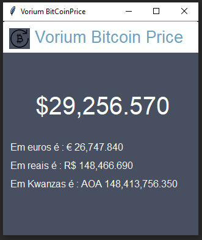

# BitcoinPricePY
Este é um simples script em Python que rastreia o preço do Bitcoin em várias moedas. O script usa a API da Cryptocompare para obter as informações mais recentes sobre o preço do Bitcoin em USD, EUR, AOA e BRL. O script é construído usando a biblioteca tkinter para criar a interface do usuário e a biblioteca PIL para manipulação de imagem.

## Instalação
Para executar o script, você precisa ter o Python 3 instalado em seu computador. Você pode baixar a versão mais recente do Python no site oficial.

## Como usar

*Clone este repositório.

*Instale as bibliotecas necessárias com o comando pip install -r requirements.txt.

*Execute o script com o comando python bitcoin_price_tracker.py.

*O script exibirá o preço atual do Bitcoin em USD, EUR, AOA e BRL. 

